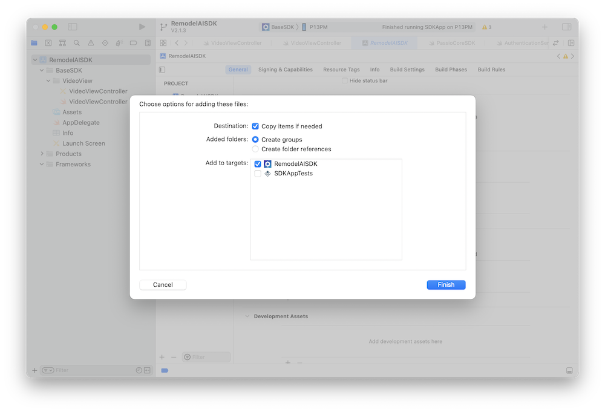

# Passio Remodel-AI iOS SDK

## Overview

Welcome to Passio Remodel-AI iOS SDK!

When integrated into your app, the SDK provides you with recognition of:
 * Environment
 * SurfaceMaterial
 * Abnormality
 * abnormality SSD (Single Shot MultiBox Detector)

The SDK creates a video preview layer and outputs recognized by our computer vision technology in the video feed of your live camera along with the recognized classes.

By default the SDK does not record/store any photos or videos. Instead, as the end user hovers over an item with his/her camera phone, the SDK recognizes and identifies the items in real time. This hovering action is only transitory/temporary while the end user is pointing the camera at a particular item and is not recorded or stored within the SDK. As a developer, you can configure the SDK to capture images or videos and store them in your app.


## BEFORE YOU CONTINUE:

1. To use the SDK please make sure you receive your SDK license key from Passio. The SDK WILL NOT WORK without a valid SDK key.

3. You will have to download the latest releases from the link below. The command "git clone" **WILL NOT** download the PassioRemodelAISDK.xcframework. <https://github.com/Passiolife/Passio-Remodel-AI-iOS-SDK-Distribution/releases>. 
Download the ```RemodelAISDK``` and copy the ```PassioRemodelAISDK.xcframework``` to your project. Make sure you have followed the directions in the README files.

## Minimum Requirements

In order to use the PassioSDK your app needs to meet the following minimal requirements:

* The SDK will only run on iOS 13 or newer. The XCFramework is compiled for min iOS version 12.0.
* Passio SDK can only be used on a device and will not run on a simulator
* The SDK requires access to iPhone's camera

## Try first to run the Quick Start Demo

  A fast and easy way to get started with the SDK is to test it inside of PassioRemodelAISDK Demo App included in this package. Here are the steps:
  
  1. Open the project in Xcode:
  2. Replace the SDK Key in the PassioRemodelAISDK.swift file with the license key you get from Passio
  3. Connect your iPhone and run
  4. Modify the app bundle from "com.PassioDemoApp.demo" to "com.yourcompany...."
  5. Run the demo app on your iPhone.
  6. For support, please contact support@passiolife.com

***

## Adding Passio SDK into your project

### Add the XCframework to your project

* Drag and drop the "RemodelAISDK.xcframework" into your project. Make sure to select "Copy items if needed".
  
  


### Change Framework to "Embed & Sign"
* In project "General" -> "Frameworks, Libraries and Embedded Content" Change to "Embed & Sign"

 
### Edit your Info.plist

* If opening from Xcode, right click and select 'open as source code'
* To allow camera usage add:

 ```XML
`<key>>NSCameraUsageDescription</key><string>For real-time recognition</string>`.
```

* To allow the data collection API (please contact support@passiolife.com for more information) add:

 ```XML
`<key>NSMicrophoneUsageDescription</key>
 <string>To record videos with sound for classification</string>`
 `<key>NSPhotoLibraryAddUsageDescription</key>
 <string>To select images and videos for classification</string>`
```

***

### Initialize and configure the SDK

1) At the top of your view controller import the RemodelAISDK and AVFoundation

```swift
import AVFoundation
import PassioRemodelAISDK
```

2) Add the following properties to your view controller. 

```swift
let passioSDK = PassioRemodelAI.shared
var videoLayer: AVCaptureVideoPreviewLayer?
```

3) In viewDidLoad configure the SDK with the Key you have received form Passio. 

```swift 
override func viewDidLoad() {
        super.viewDidLoad()
        let key = "Your_PassioSDK_Key"
        //* Use the API key you received from us or request a key from [support@passiolife.com](support@passiolife.com).
        let passioConfig = PassioConfiguration(key: key)
        passioSDK.configure(passioConfiguration: passioConfig) { (status) in
            print("Mode = \(status.mode)\nmissingfiles = \(String(describing: status.missingFiles))" )
        }
         passioSDK.statusDelegate = self
    }
```

4) You will receive the PassioStatus back from the SDK.

```Swift
public struct PassioStatus {
    public internal(set) var mode: PassioSDK.PassioMode { get }
    public internal(set) var missingFiles: [PassioSDK.FileName]? { get }
    public internal(set) var debugMessage: String? { get }
    public internal(set) var activeModels: Int? { get }
}

public enum PassioMode {
    case notReady
    case isBeingConfigured
    case isDownloadingModels
    case isReadyForDetection
    case failedToConfigure
}
```

5) In `viewWillAppear` request authorization to use the camera and start the recognition:

```swift
override func viewWillAppear(_ animated: Bool) {
        super.viewWillAppear(animated)
        if AVCaptureDevice.authorizationStatus(for: .video) == .authorized { // already authorized
            setupVideoLayer()
        } else {
            AVCaptureDevice.requestAccess(for: .video) { (granted) in
                if granted { // access to video granted
                    DispatchQueue.main.async {
                        self.setupVideoLayer()
                    }
                } else {
                    print("The user didn't grant access to use camera")
                }
            }
        }
    }

  ```

6) Add the method `setupVideoLayer`:

```swift
 func setupVideoLayer() {
        guard videoLayer == nil else { return }
        if let vLayer = passioSDK.getPreviewLayer() {
            self.videoLayer = vLayer
            videoLayer?.videoGravity = AVLayerVideoGravity.resizeAspectFill
            videoLayer?.frame = view.frame
            view.layer.insertSublayer(vLayer, at: 0)
        }
    }
```

7) Add the method `startDetection()`  

```swift
  func startDetection() {
        PassioRemodelAI.shared.startCustomObjectDetection(modelName: activeModelType.mlModelName,
                                                          customDetectionDelegate: self) { isReady in
            print("startCustomObjectDetection started \(isReady)" )
        }
    }

    func stopDetection() {
        PassioRemodelAI.shared.stopCustomDetection()
    }
```


8) Stop  Detection in `viewWillDisappear`:

  ```swift
 override func viewWillDisappear(_ animated: Bool) {
        super.viewWillDisappear(animated)
        passioSDK.stopDetection()
        videoLayer?.removeFromSuperlayer()
        videoLayer = nil
    }
  ```

9) Implement the delegate `CustomDetectionDelegate`:

  ```swift
extension VideoViewController: CustomDetectionDelegate {


    func customDetectionResult(customCandidates: [CustomCandidate]?,
                               hnnCandidates: [CustomClassificationCandidate]?,
                               classCandidates: [CustomClassificationCandidate]?,
                               image: UIImage?) {
       
        switch activeModelType {
        case .abnormality, .environment, .surfaceMaterial:
                if let first = classCandidates?.first, first.passioID != "BKG0001" {
                    self.displayCandidate(detectedPassioID: first.passioID)
                }
        case .abnormalitySSD:
            if let first = customCandidates?.first, first.passioID != "BKG0001" {
                self.displayCandidate(detectedPassioID: first.passioID)
                self.displayBoundingBox(box: first.boundingBox)
            }
        }
    }

}
```

10 ) Implement the `PassioStatusDelegate`:

```swift 
extension VideoViewController: PassioStatusDelegate {

    func passioStatusChanged(status: PassioStatus) {
        if status.mode == .isReadyForDetection {
            DispatchQueue.main.async {
                self.startDetection()
            }
        }
    }

    func passioProcessing(filesLeft: Int) {
        DispatchQueue.main.async {

        }
    }

    func completedDownloadingAllFiles(filesLocalURLs: [FileLocalURL]) {
        DispatchQueue.main.async {
            
        }
    }

    func completedDownloadingFile(fileLocalURL: FileLocalURL, filesLeft: Int) {
        DispatchQueue.main.async {
            
        }
    }

    func downloadingError(message: String) {
        print("downloadError   ---- =\(message)")
        DispatchQueue.main.async {

        }
    }

}
```
<sup>Copyright 2023 Passio Inc</sup>
